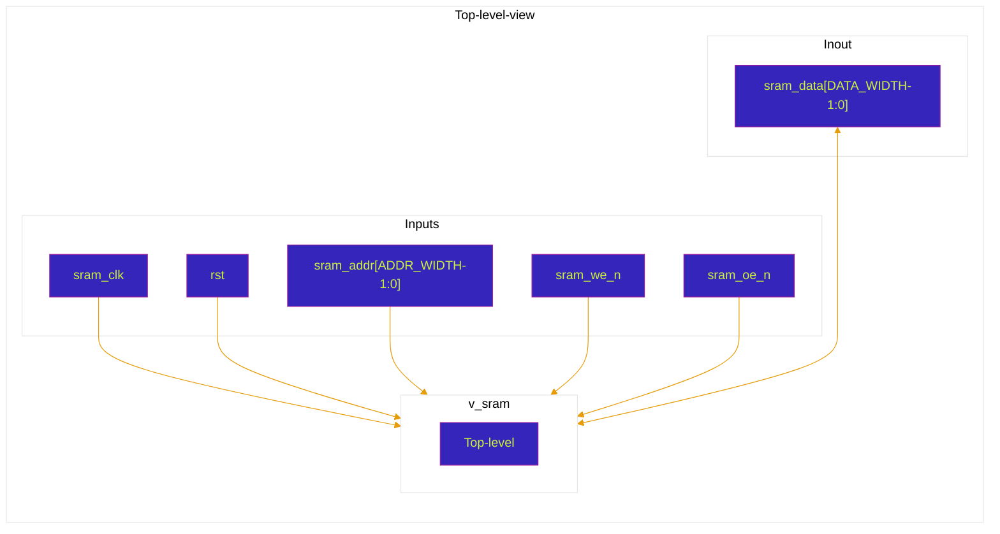

# v_sram
Modelo virtualizado de sram, implementei o suporte ao burst mode e a compatibilidade com múltiplos bancos de memória, agora irei testar o funcionamento do topo da sram.

## Esboço de topo do bloco

| Porta        | Direção | Largura      | Descrição |
|--------------|---------|--------------|-----------|
| `sram_clk`   | input   | `1`          | Clock utilizado para registrar operações de leitura e escrita. |
| `rst`        | input   | `1`          | Reset assíncrono ativo em nível alto. Zera o registrador temporário de leitura `temp_bank`. |
| `sram_addr`  | input   | `ADDR_WIDTH` | Endereço da posição de memória acessada. |
| `sram_we_n`  | input   | `1`          | Write Enable ativo em nível baixo. `0`: escrita; `1`: leitura. |
| `sram_oe_n`  | input   | `1`          | Output Enable ativo em nível baixo. `0`: bloco habilitado; `1`: bloco em idle/barramento em alta impedância. |
| `sram_data`  | inout   | `DATA_WIDTH` | Barramento bidirecional de dados. Recebe dados na escrita e dirige dados na leitura. |

## Parâmetros do bloco

| Parâmetro    | Valor padrão | Descrição |
|--------------|--------------|-----------|
| `DATA_WIDTH` | `36`         | Largura do barramento de dados. |
| `ADDR_WIDTH` | `21`         | Largura do barramento de endereços. |
| `DATA_DEPTH` | `1000000`    | Profundidade lógica do banco de memória. |
| `T_AW`       | `ADDR_WIDTH - 1` | Índice máximo utilizado para o vetor de endereço. |
| `T_DW`       | `DATA_WIDTH - 1` | Índice máximo utilizado para o vetor de dados. |
| `T_DD`       | `DATA_DEPTH - 1` | Índice máximo utilizado para o banco de memória. |

# Diagrama de topo do bloco virtualizado

## Comportamento esperado pelo bloco

O `v_sram` modela uma memória SRAM virtualizada com barramento de dados bidirecional e controle por sinais ativos em nível baixo.

A seleção da operação é feita de forma combinacional pela FSM de controle:

| `sram_oe_n` | `sram_we_n` | Estado interno | Operação |
|-------------|-------------|----------------|----------|
| `1`         | `x`         | `IDLE`         | Bloco desabilitado. O barramento `sram_data` permanece em alta impedância. |
| `0`         | `0`         | `WRITE_MODE`   | Escrita síncrona no endereço `sram_addr`. |
| `0`         | `1`         | `READ_MODE`    | Leitura síncrona do endereço `sram_addr`. |

Na escrita, quando `sram_oe_n = 0` e `sram_we_n = 0`, o dado presente em `sram_data` é armazenado em `data_bank[sram_addr]` na borda de subida de `sram_clk`.

Na leitura, quando `sram_oe_n = 0` e `sram_we_n = 1`, o conteúdo de `data_bank[sram_addr]` é carregado em `temp_bank` na borda de subida de `sram_clk`. O barramento `sram_data` passa a ser dirigido com o valor de `temp_bank` enquanto a leitura estiver habilitada.

Quando `sram_oe_n = 1`, o bloco permanece em `IDLE` e o barramento `sram_data` é colocado em alta impedância (`Z`), permitindo que outro agente controle o barramento externo.

Durante o reset (`rst = 1`), o registrador temporário de leitura `temp_bank` é zerado de forma assíncrona. O conteúdo de `data_bank` não é inicializado pelo reset no RTL atual.

## Observações de uso

- O barramento `sram_data` deve ser dirigido externamente apenas durante operações de escrita.
- Durante operações de leitura, o módulo passa a dirigir `sram_data`; o agente externo deve deixar o barramento em alta impedância para evitar contenção.
- A leitura é registrada: o dado lido de `data_bank` é transferido para `temp_bank` na borda de subida do clock.
- O modelo é adequado para simulação/comportamento funcional de uma SRAM, não necessariamente para inferência direta de uma memória física específica em FPGA/ASIC.

