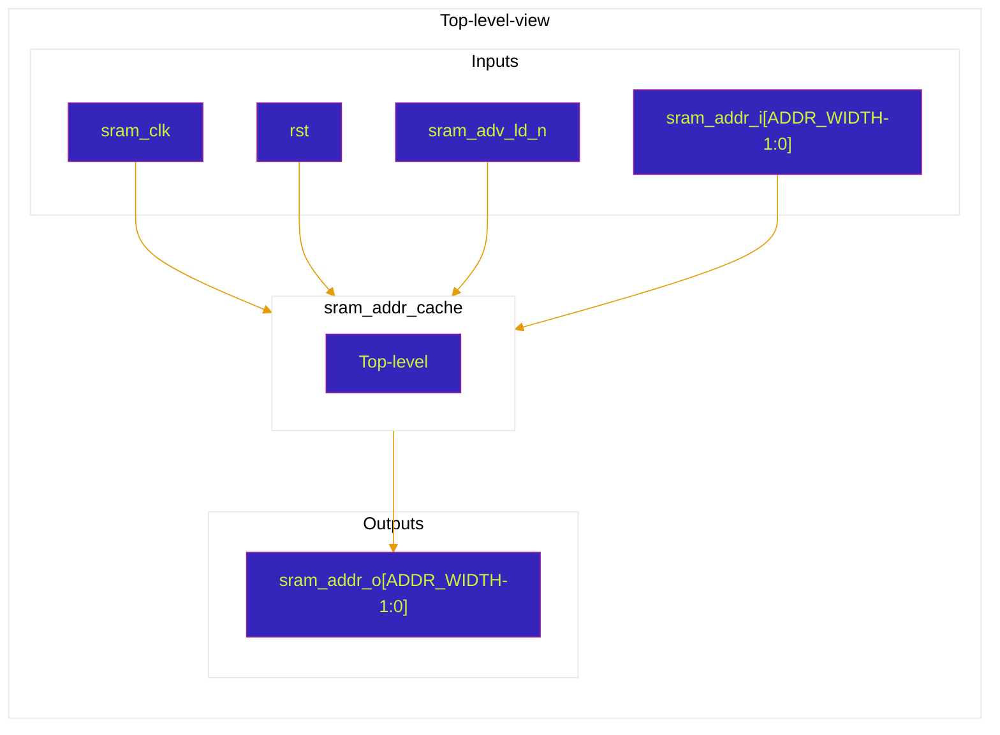

# sram_addr_cache
Modelo virtualizado de cache/registrador de endereço para suporte auxiliar a operações em modo burst em uma SRAM.

O bloco não armazena dados. Ele registra um endereço interno temporário (`sram_addr_t`) e disponibiliza esse endereço na saída `sram_addr_o`, podendo ser usado como estágio auxiliar para alimentar o endereço de um banco SRAM durante uma sequência de acesso.

## Esboço de topo do bloco

| Porta           | Direção | Largura      | Descrição |
|-----------------|---------|--------------|-----------|
| `sram_clk`      | input   | `1`          | Clock utilizado para registrar o endereço interno. |
| `rst`           | input   | `1`          | Reset assíncrono ativo em nível baixo. Quando `rst = 0`, zera o registrador temporário `sram_addr_t`. |
| `sram_adv_ld_n` | input   | `1`          | Controle ativo em nível baixo. Quando `0`, carrega `sram_addr_i + 1` no registrador interno. Quando `1`, mantém o valor atual. |
| `sram_addr_i`   | input   | `ADDR_WIDTH` | Endereço de entrada usado como base para gerar o próximo endereço registrado. |
| `sram_addr_o`   | output  | `ADDR_WIDTH` | Endereço registrado disponibilizado para o restante do sistema. |

## Parâmetros do bloco

| Parâmetro    | Valor padrão | Descrição |
|--------------|--------------|-----------|
| `DATA_WIDTH` | `36`         | Largura de dados herdada do padrão do projeto. No RTL atual deste bloco, não é utilizada diretamente. |
| `ADDR_WIDTH` | `21`         | Largura do barramento de endereços. |
| `DATA_DEPTH` | `1000000`    | Profundidade lógica herdada do padrão do projeto. No RTL atual deste bloco, não é utilizada diretamente. |
| `T_AW`       | `ADDR_WIDTH - 1` | Índice máximo utilizado para os vetores de endereço. |
| `T_DW`       | `DATA_WIDTH - 1` | Índice máximo do vetor de dados herdado do padrão do projeto. No RTL atual deste bloco, não é utilizado diretamente. |
| `T_DD`       | `DATA_DEPTH - 1` | Índice máximo de profundidade herdado do padrão do projeto. No RTL atual deste bloco, não é utilizado diretamente. |

# Diagrama de topo do bloco virtualizado

## Comportamento esperado pelo bloco

O `sram_addr_cache` modela um registrador de endereço auxiliar. Seu objetivo é armazenar um endereço temporário que pode ser usado por outro bloco, como o `sram_bank`, durante uma operação sequencial ou de burst.

A operação é feita de forma síncrona na borda de subida de `sram_clk`, com reset assíncrono ativo em nível baixo:

| `rst` | `sram_adv_ld_n` | Operação interna | Valor de `sram_addr_o` |
|-------|------------------|------------------|-------------------------|
| `0`   | `x`              | Reset assíncrono | `0` |
| `1`   | `0`              | Carrega próximo endereço | `sram_addr_i + 1` após a próxima borda de subida de `sram_clk` |
| `1`   | `1`              | Mantém endereço atual | Valor previamente armazenado em `sram_addr_t` |

Durante o reset (`rst = 0`), o registrador temporário `sram_addr_t` é zerado de forma assíncrona.

Quando `rst = 1` e `sram_adv_ld_n = 0`, o bloco registra `sram_addr_i + 1` em `sram_addr_t` na borda de subida de `sram_clk`. Esse valor passa a aparecer em `sram_addr_o`, pois a saída é continuamente atribuída ao registrador interno.

Quando `rst = 1` e `sram_adv_ld_n = 1`, o bloco mantém o último endereço registrado. Nesse estado, `sram_addr_o` permanece estável.

## Relação com o modo burst

No RTL atual, o bloco não implementa sozinho uma sequência completa de burst. Ele apenas calcula e registra um único endereço derivado de `sram_addr_i + 1` quando `sram_adv_ld_n` está ativo em nível baixo.

Assim, para uma implementação completa de burst, o controle externo ainda precisa definir quando carregar um novo endereço-base, quando reutilizar `sram_addr_o` e como avançar os próximos endereços da sequência.

## Observações de uso

- O reset deste bloco é ativo em nível baixo (`negedge rst`), diferente de blocos que usam reset ativo em nível alto.
- A saída `sram_addr_o` é puramente derivada do registrador interno `sram_addr_t`.
- O endereço carregado não é exatamente `sram_addr_i`, mas sim `sram_addr_i + 1`.
- O RTL atual não incrementa automaticamente `sram_addr_t` a cada ciclo de burst; ele apenas carrega `sram_addr_i + 1` quando `sram_adv_ld_n = 0` e mantém o valor quando `sram_adv_ld_n = 1`.
- Caso a intenção seja seguir a semântica típica de sinais `ADV/LD#` de SRAM síncrona, revise se o comportamento desejado é carregar endereço quando `ADV/LD# = 0` e avançar endereço quando `ADV/LD# = 1`.
- Como `sram_addr_t` possui largura fixa `ADDR_WIDTH`, um estouro em `sram_addr_i + 1` retorna naturalmente para zero por truncamento do vetor.

