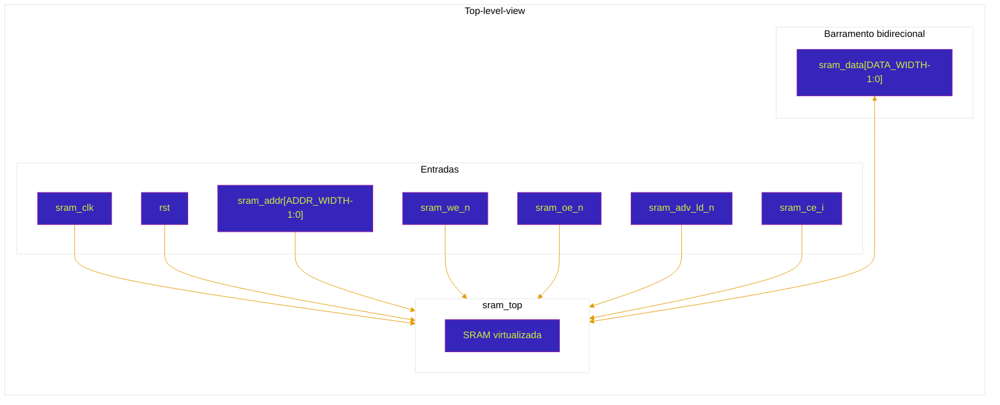

# sram_top

Modelo funcional de uma SRAM com dois bancos de memória, barramento bidirecional de dados e suporte a acessos em modo normal e em modo burst.

Este documento descreve somente a **interface externa** e o **comportamento observável** do bloco. A validação deve ser realizada em caixa-preta, utilizando exclusivamente as portas do módulo.

## Interface do bloco

| Porta           | Direção | Largura      | Descrição |
|-----------------|---------|--------------|-----------|
| `sram_clk`      | input   | `1`          | Clock utilizado para sincronizar as operações de leitura, escrita e controle de endereço. |
| `rst`           | input   | `1`          | Reset assíncrono ativo em nível baixo. |
| `sram_addr`     | input   | `ADDR_WIDTH` | Endereço-base da operação de memória. |
| `sram_we_n`     | input   | `1`          | Write Enable ativo em nível baixo. `0`: escrita; `1`: leitura. |
| `sram_oe_n`     | input   | `1`          | Output Enable ativo em nível baixo. `0`: memória habilitada; `1`: memória desabilitada. |
| `sram_adv_ld_n` | input   | `1`          | Seleção do modo de endereçamento. `1`: modo normal; `0`: modo burst. |
| `sram_ce_i`     | input   | `1`          | Seleção do banco. `0`: banco A; `1`: banco B. |
| `sram_data`     | inout   | `DATA_WIDTH` | Barramento bidirecional utilizado para entrada de dados na escrita e saída de dados na leitura. |

## Parâmetros

| Parâmetro    | Valor padrão | Descrição |
|--------------|--------------|-----------|
| `DATA_WIDTH` | `18`         | Largura do barramento de dados. |
| `ADDR_WIDTH` | `21`         | Largura do barramento de endereços. |
| `BANK_QUANT` | `2`          | Quantidade de bancos de memória. |
| `DATA_DEPTH` | `1000000`    | Quantidade de posições disponíveis em cada banco. |
| `T_AW`       | `ADDR_WIDTH - 1` | Índice máximo do barramento de endereços. |
| `T_DW`       | `DATA_WIDTH - 1` | Índice máximo do barramento de dados. |
| `T_DD`       | `DATA_DEPTH - 1` | Índice máximo das posições de memória. |
| `T_BQ`       | `BANK_QUANT - 1` | Índice máximo dos bancos de memória. |

## Diagrama de topo

## Convenções dos sinais de controle

Os sinais terminados em `_n` são ativos em nível baixo.

| `sram_oe_n` | `sram_we_n` | Operação observável |
|-------------|-------------|---------------------|
| `1`         | `x`         | Memória desabilitada e barramento de dados em alta impedância. |
| `0`         | `0`         | Escrita no banco e endereço selecionados. |
| `0`         | `1`         | Leitura do banco e endereço selecionados. |

### Seleção do banco

| `sram_ce_i` | Banco selecionado |
|-------------|-------------------|
| `0`         | Banco A |
| `1`         | Banco B |

Os bancos devem operar de forma independente. Uma escrita realizada em determinado endereço de um banco não deve alterar o conteúdo do mesmo endereço no outro banco.

### Seleção do modo de endereçamento

| `sram_adv_ld_n` | Modo de operação |
|-----------------|------------------|
| `1`             | Modo normal |
| `0`             | Modo burst |

## Modo normal

No modo normal, cada operação utiliza diretamente o endereço aplicado em `sram_addr`.

### Escrita

1. Manter `rst = 1`.
2. Selecionar o banco por `sram_ce_i`.
3. Aplicar o endereço desejado em `sram_addr`.
4. Manter `sram_adv_ld_n = 1`.
5. Dirigir o valor de escrita em `sram_data`.
6. Aplicar `sram_oe_n = 0` e `sram_we_n = 0`.
7. Manter os sinais estáveis durante a borda de subida de `sram_clk`.
8. Liberar `sram_data` após a escrita.

### Leitura

1. Manter `rst = 1`.
2. Selecionar o banco por `sram_ce_i`.
3. Aplicar o endereço desejado em `sram_addr`.
4. Manter `sram_adv_ld_n = 1`.
5. Liberar externamente o barramento `sram_data`.
6. Aplicar `sram_oe_n = 0` e `sram_we_n = 1`.
7. Amostrar o dado após a borda de subida de `sram_clk`.

O valor lido deve ser igual ao último valor escrito no mesmo banco e endereço.

## Modo burst

No modo burst, `sram_addr` estabelece o endereço-base da sequência, enquanto o controle de avanço seleciona os endereços consecutivos utilizados nas operações seguintes.

A validação deve observar os seguintes requisitos externos:

- os acessos devem ocorrer em posições consecutivas;
- a sequência deve respeitar a largura configurada por `ADDR_WIDTH`;
- leituras realizadas após as escritas devem retornar os dados na mesma ordem;
- a seleção de banco deve permanecer válida durante toda a sequência;
- o funcionamento de um banco não deve alterar os dados armazenados no outro;
- ao ultrapassar o maior endereço representável, a sequência deve retornar ao endereço zero.

O testbench deve determinar a latência do primeiro endereço válido e verificar a continuidade da sequência somente pelas portas externas do módulo.

## Reset

O reset é assíncrono e ativo em nível baixo.

Durante o reset:

- os registradores de saída e de controle devem retornar ao estado inicial;
- nenhuma operação de escrita deve ser considerada válida;
- o testbench não deve exigir que todo o conteúdo previamente armazenado seja apagado, salvo quando isso fizer parte da especificação complementar do projeto.

Após liberar o reset, recomenda-se aguardar ao menos uma borda de subida de `sram_clk` antes de iniciar a primeira transação.

## Barramento bidirecional

O barramento `sram_data` deve possuir apenas um driver ativo por vez:

- durante a escrita, o testbench dirige `sram_data`;
- durante a leitura, o testbench libera `sram_data` para que o DUT apresente o valor lido;
- quando `sram_oe_n = 1`, espera-se que o DUT mantenha o barramento em alta impedância.

A presença de valores desconhecidos pode indicar endereço sem inicialização, contenção no barramento, violação de temporização ou falha na sequência de controle.

## Escopo da validação

A validação deve tratar `sram_top` como uma caixa-preta. Não é necessário acessar registradores, memórias, estados ou sinais internos por referência hierárquica. Todos os estímulos e todas as verificações devem ser realizados exclusivamente por meio das portas públicas descritas neste documento.

